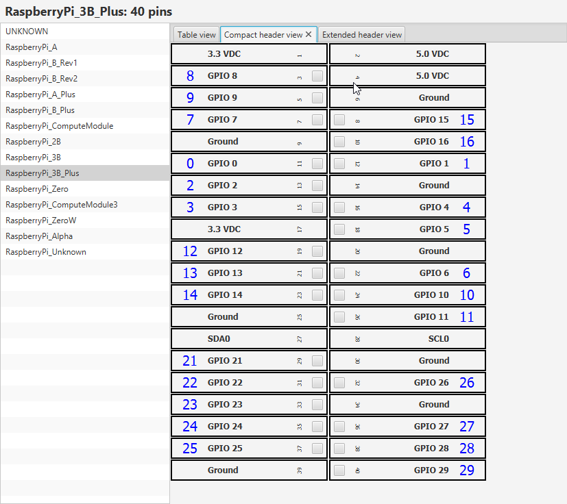
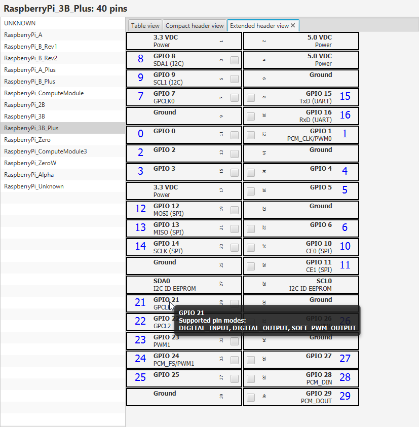

Pi4J :: JavaFX visualization on top of Pi4J Java I/O Library for Raspberry Pi
==============================================================================
JavaFX UI for PI4J

## PROJECT INFORMATION

### Version May 2019
This JavaFX User Interface uses some of the pi4j.core classes to show a list of predefined Raspberry Pi board types. By selecting one, you get more info about the pinning layout in table, compact pin view and extended pin view.






## IDEAS FOR THE FUTURE
* Run this app on a Pi to visualize the status of its pins
* Run this app on a PC to visualize the status of the pins of one or more Pi's via remote calls (websockets?) 
* Make the pins in the header view interactive to change the state on the (local/remote) board

## COMPILING
This application can be compiled with Maven. Use following commands to build a JAR which can be run on PC and Pi.

```
compiler:compile
jar:jar
```

## RUNNING 
BellSoft provides a Java 11 version for the Pi which includes the JavaFX-dependencies.
You can install it following these steps on e.g. Raspian.

```
# Make sure we are in the home directory
cd /home/pi

# Download the Java 11.0.2 distribution from BellSoft
wget https://download.bell-sw.com/java/11.0.2/bellsoft-jdk11.0.2-linux-arm32-vfp-hflt.tar.gz

# Move the downloaded file to /opt
sudo mv bellsoft-jdk11.0.2-linux-arm32-vfp-hflt.tar.gz /opt

# Use the /opt directory
cd /opt

# Untar the downloaded file
sudo tar -xvzf bellsoft-jdk11.0.2-linux-arm32-vfp-hflt.tar.gz

# Remove the downloaded file
sudo rm bellsoft-jdk11.0.2-linux-arm32-vfp-hflt.tar.gz
```

To run the application get it from the out-directory and start it with this command

```
cd {LOCATION OF THE JAR-FILE}
sudo /opt/jdk-11.0.2/bin/java -jar pi4j-fxui-2.0-SNAPSHOT.jar
```

## LICENSE
See overall Pi4J license.