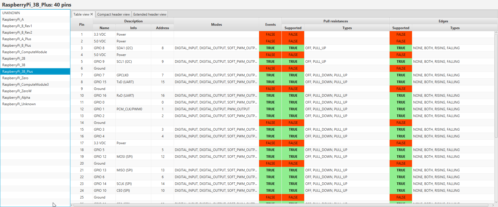

 Pi4J :: JavaFX visualization on top of Pi4J Java I/O Library for Raspberry Pi
==============================================================================
JavaFX UI for PI4J

## PROJECT INFORMATION

### Version May 2019
This JavaFX User Interface uses some of the pi4j.core classes to show a list of predefined Raspberry Pi board types. By selecting one, you get more info about the pinning layout in table, compact pin view and extended pin view.

## IDEAS FOR THE FUTURE
* Run this app on a Pi to visualize the status of its pins
* Run this app on a PC to visualize the status of the pins of one or more Pi's via remote calls (websockets?) 

## LICENSE
See overall Pi4J license.